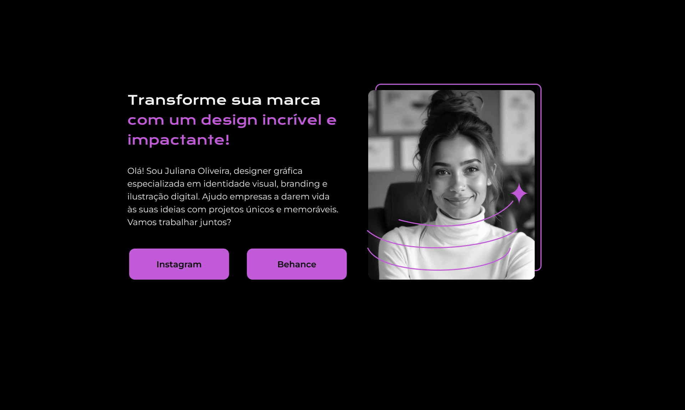

# Desafio: Criando uma página web a partir de um layout no figma

Você recebeu o layout de uma página de portfólio no Figma e seu objetivo é transformá-lo em uma página web funcional, utilizando HTML. O foco é na estruturação semântica do conteúdo, acessibilidade e boas práticas de desenvolvimento.

## Layout do Figma:

## Instruções:

### 1. Estrutura Básica do HTML:
- Crie a estrutura básica de um documento HTML.
- Utilize as tags semânticas `header`, `main` e `footer` para organizar o conteúdo da página.
- No `main`, insira os seguintes elementos:
	- Um título principal (`<h1>`) com parte do texto destacado (`<strong>`).
	- Um subtítulo ou parágrafo (`
`) com uma breve introdução sobre a profissional.
	- Dois botões que redirecionem para as redes sociais da profissional (Instagram e Behance).
	- Uma imagem (``) representando a profissional, com os atributos `src` (caminho da imagem) e `alt` (descrição da imagem) corretamente preenchidos.
	
### 2. Configurações do Cabeçalho:
- Ajuste a tag `<html>` para o idioma português do Brasil (`lang="pt-br"`).
- Defina o charset como **UTF-8**.
- Altere o título da página (`<title>`) para algo relacionado ao projeto, por exemplo: _"Portfólio de [Nome da Profissional]"_.
- Adicione as seguintes meta tags:
	- meta para compatibilidade com o Microsoft Edge.
	- meta para configurar o viewport, garantindo que a página seja responsiva.
	
### 3. Links e Acessibilidade:
- Utilize a tag `<a>` para criar links nos botões, direcionando para o Instagram e Behance da profissional.
- Certifique-se de que todos os elementos estejam corretamente formatados e alinhados conforme o layout do Figma.
- Lembre-se de que a descrição no atributo `alt` da imagem é essencial para acessibilidade.

#### Dicas:
- Revise o layout do Figma para garantir que a estrutura e o posicionamento dos elementos estejam alinhados com o design proposto.
- Teste a página em diferentes navegadores para garantir compatibilidade.