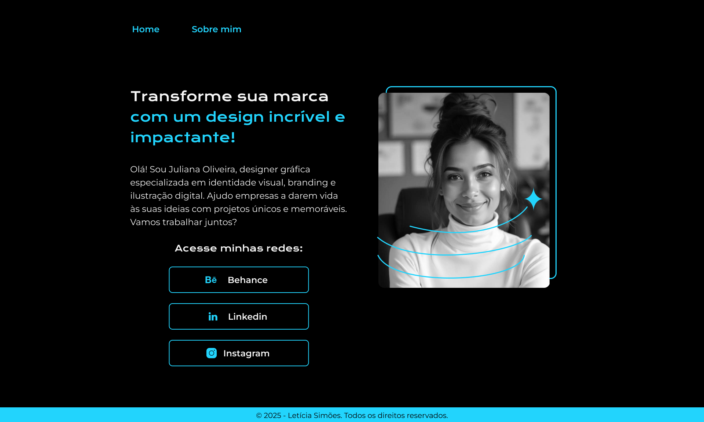
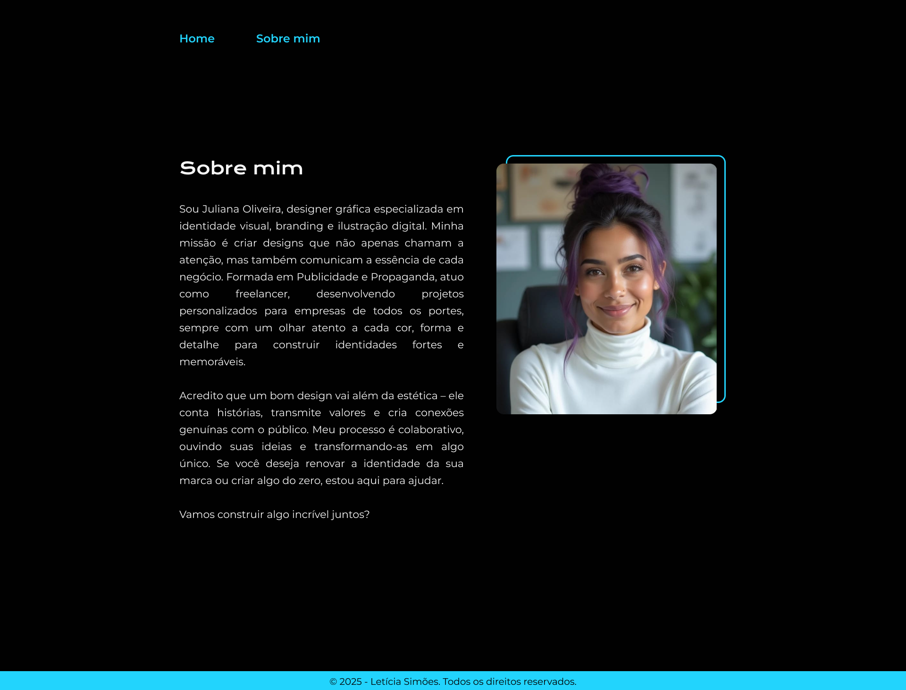

# Desafio: Ajustes e Refinamento do Portfólio com HTML e CSS

No desenvolvimento web, é comum que após a entrega de um projeto, o cliente solicite ajustes e melhorias com base em um novo direcionamento visual. Neste desafio, você recebeu um novo layout no Figma e deverá aplicar as alterações necessárias para que a página do portfólio fique o mais fiel possível ao modelo atualizado.

## Objetivo:
O seu desafio é ajustar o código HTML e CSS para que a página fique o mais fiel possível ao novo modelo.

## Layout do Figma:

## O que você deve aplicar?

- Menus de navegação responsivos
- Uso de variáveis globais no CSS
- Estilização de botões com ícones
- Reutilização eficiente de classes
- Boas práticas de desenvolvimento front-end