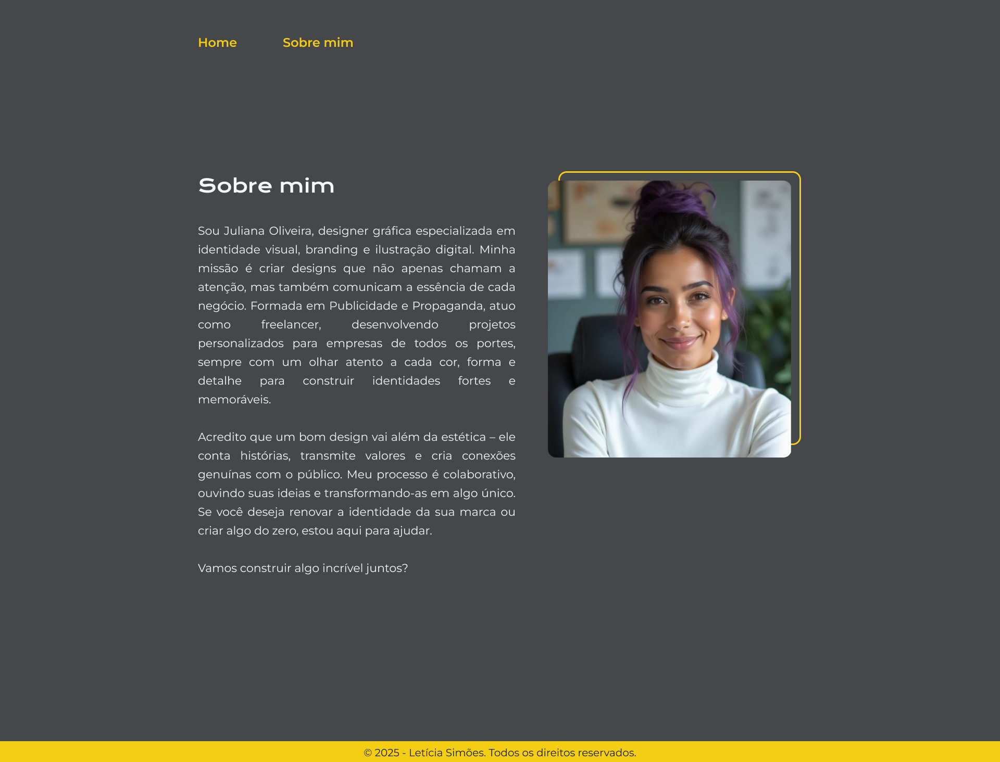

# Desafio: Ajustando as Variáveis Globais no CSS
Após a entrega do portfólio atualizado, alguns meses se passaram e sua cliente entrou em contato com uma nova solicitação. Como parte de uma campanha publicitária temporária, será necessário modificar a paleta de cores do site para refletir a identidade visual da campanha.

Para isso, ela enviou um novo conjunto de cores e assets, e sua tarefa é ajustar as variáveis globais do CSS para que a página fique visualmente fiel ao novo modelo.

## Objetivo:
Atualizar as variáveis globais no CSS para modificar a identidade visual do site sem alterar a estrutura do código.

## Layout do Figma:

## Paleta de Cores:

## O que você deve aplicar?

- Manipulação eficiente de variáveis CSS
- Aplicação de novas cores sem impactar a organização do código
- Garantia de consistência visual com base no novo modelo