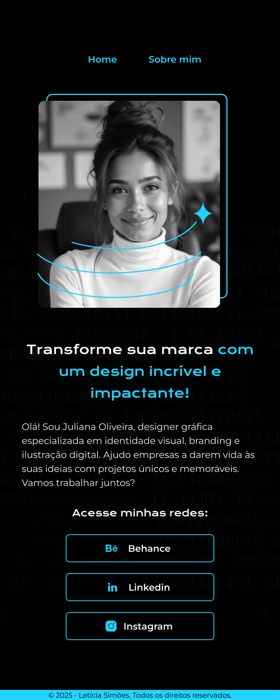
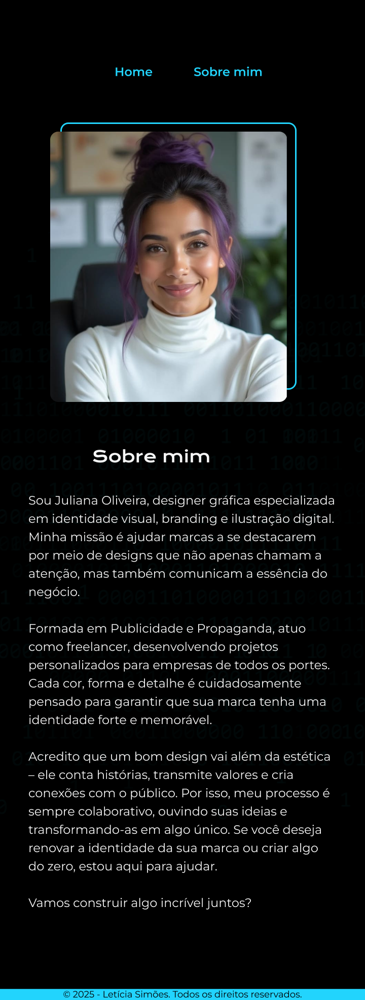

# Desafio Final: Tornando seu Portfólio Responsivo

No desafio anterior, você desenvolveu um portfólio para sua cliente utilizando apenas HTML e CSS. O resultado ficou ótimo! Porém, ao testar em diferentes dispositivos, percebeu-se que a página não é responsiva.

Agora, sua cliente enviou um modelo atualizado no Figma, mostrando como o portfólio deve se comportar em telas menores. Seu desafio final é tornar a página responsiva, deixando-a o mais fiel possível ao novo design!

## O que é responsividade?
Responsividade é a capacidade de um site se adaptar a diferentes tamanhos de tela, garantindo uma boa experiência de navegação em computadores, tablets e celulares. Para isso, utilizamos técnicas como media queries, flexbox e ajustes de fontes e espaçamentos.

## Objetivo:
Ajustar o código HTML e CSS para que o portfólio fique totalmente responsivo, mantendo a fidelidade ao modelo atualizado no Figma.

## Layout do Figma:

## O que você deve aplicar?

- Media Queries para adaptar os estilos a diferentes tamanhos de tela.
- Ajustes de fontes, espaçamentos e imagens para melhorar a usabilidade.
- Testes em diferentes dispositivos e resoluções para garantir uma boa experiência.